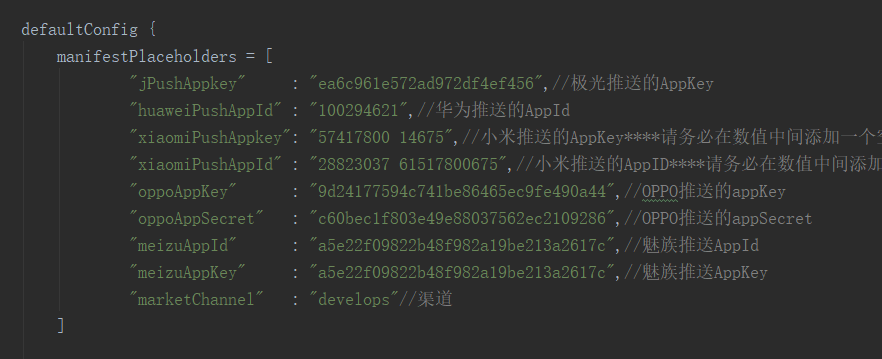
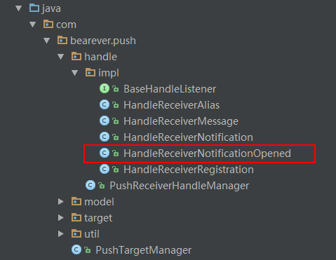
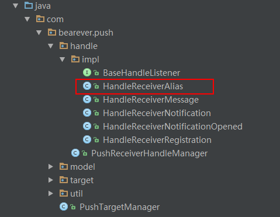

# Push

一个推送的模块，集成了华为、小米、魅族、OPPO和极光推送，根据设备厂商判断使用具体哪个SDK如：小米手机使用小米推送，华为手机使用华为推送，其他的设备使用极光推送。

## 更新时间

2018/10/09

## 使用

### 1.配置AppKey

在push模块下面的`buid.gradle`文件里面替换对应的AppKey，**需要注意的地方**：

> 小米的AppKey和魅族的AppId是使用的数字的格式，不能直接复制粘粘到文件里面，需要在中间增加一个空格，例如：AppKey为`201584151343514321321`需要替换为`20158415134 3514321321`

### 2.配置华为推送

华为推送的SDK是通过工具生成的，所以需要手动配置生成代码，先[下载华为HMS Agent套件](https://obs.cn-north-2.myhwclouds.com/hms-ds-wf/sdk/HMSAgent_2.6.1.302.zip)，解压出来之后根据自己的电脑系统需要相应的脚本文件，例如：Window点击双击`GetHMSAgent_cn.bat`在弹出的窗口里面根据提示操作就好了，最后生存的代码会保存在`copysrc`文件夹里面。将生成的代码复制到Push的java目录下面，res资源文件根据需要添加到资源目录下。

### 3.初始化

在Application的onCreate里面调用`PushTargetManager`的`init`方法。

### 4.处理推送消息

推送的信息分为`Message`和`Notification`，Notification会主动在通知栏显示通知，而Message不会。

要处理接收到的信息，只需要实现`HandleReceiverMessage`或者`HandleReceiverNotification`的`handle`方法即可。

### 5.处理用户点击通知栏

针对用户点击通知栏的行为，我们可能需要对通知进行处理跳转到指定的页面。当有用户点击通知栏的时候`HandleReceiverNotificationOpened`的`handle`会执行，我们只需要在这里处理就可以了。**需要注意的是，华为和OPPO的事件处理使用的是一个虚拟的Activity进行中转。 **因为无法监听到用户点击的事件，但是可以在点击之后打开的页面里面获取到传递的数据，间接的进行处理。所以使用的时候需要和后端协商好推送类型为自定义参数的格式。

> OPPO和华为的处理Activity分别为`OppoLoadActivity`、`HuaweiLoadActivity`具体的intent设置请按照自己的需求修改。

### 6.设置别名

为了区别不同的设备与账号的对应关系，需要将设备别名设置到推送服务器和自己应用的服务器。* 当然，如果你不需要知道具体用户对于的设备，也可以不处理 *。 **别名的设置需要执行`PushTargetManager`的`setAlias`, **建议在注册成功之后再执行设置别名的操作，即在`HandleReceiverRegistration`的`handle`里面执行。 **需要注意的是华为推送不支持设置别名，只能获取华为服务器返回的`token` **。对于将别名上传到服务器的操作，用户只需要在`HandleReceiverAlias`类实现`handle`方法就可以了。

## 模块设计思路

通过对推送服务的分析，我将推送分为了三个步骤，分别是：初始化、接收和处理，不同的推送平台的接收方式并不一样，但是推送服务只是一个工具，接收推送之后的处理才是关键，而这个是不需要根据不同的平台来变化的，所以我使用了一个统一的处理入口。

根据这个思路，我设计的代码结构如下：

| 目录     | 说明                                 |
| ------ | ---------------------------------- |
| Handle | 统一处理接收到的推送信息                       |
| Target | 将不同的推送平台的初始化和接收存放在这个目录里面，按照推送平台分类。 |

关于消息的处理，通常会有：SDK注册成功、接收到消息、用户点击通知栏等，所以我将不同的动作分配到具体的类里面，减少一个大类处理多个方法的问题，通过一个入口类管理具体的行为。
